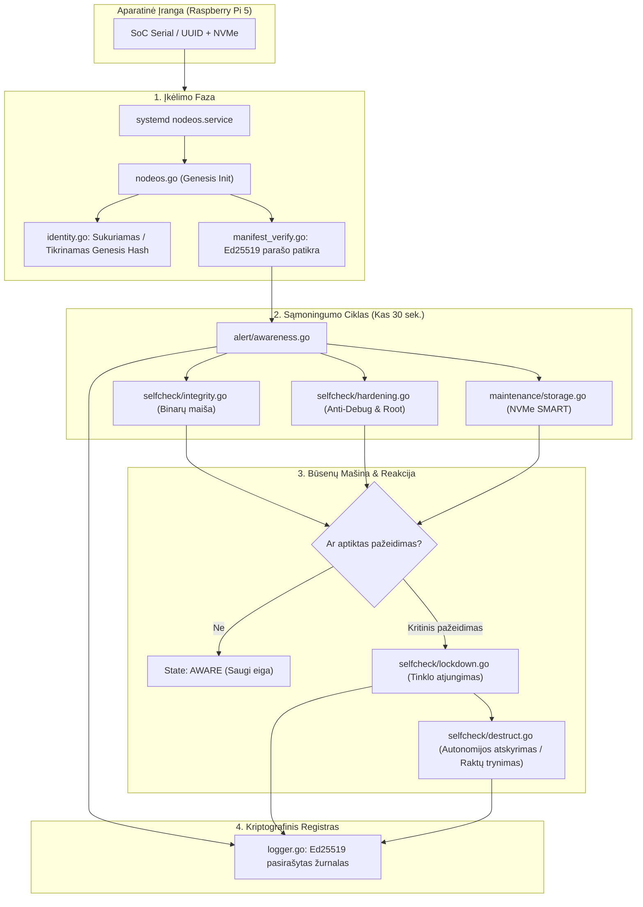

# 🌳 NodeOS — Projekto Katalogų Medis

Snapshot data: **2026-09-25**  
Organizacija: [`kibernetinio-saugumo-sprendimai`](https://github.com/kibernetinio-saugumo-sprendimai)  
Repozitorija: [`node-os`](https://github.com/kibernetinio-saugumo-sprendimai/node-os.git)  
Versija: **v0.2.0-genesis** (Genesis Core)

---

## 📁 Pilna Repozitorijos Struktūra

```text
node-os/
├── 📄 .gitignore                   # Git ignoruojami binariniai failai ir sertifikatai
├── 📄 AUDIT_REPORT.md              # 🛡️ Oficiali nepriklausomo saugumo audito ataskaita
├── 📄 AUDIT_REPORT.md.sig          # 🔏 Ed25519 skaitmeninis audito ataskaitos parašas
├── 📄 AUDIT_REPORT_EN.md           # 🇬🇧 Audito ataskaitos versija anglų kalba
├── 📄 AUDIT_REPORT_LT.md           # 🇱🇹 Audito ataskaitos versija lietuvių kalba
├── 📄 DEPLOY_GUIDE.md              # 🚀 Gamybinio diegimo į Pi 5 / Edge mazgus vadovas
├── 📄 INSTALL.md                   # 📦 Priklausomybių (Go 1.22+, smartctl) diegimo instrukcija
├── 📄 LICENSE                      # SafeStack Ecosystem licencijos nuostatos
├── 📄 Makefile                     # 🛠️ Automatizacija (setup, build, test, verify, run)
├── 📄 README.md                    # 📖 Pagrindinis projekto manifestas ir architektūros apžvalga
├── 📄 SECURITY.md                  # 🔒 Zero-Trust saugumo politika ir pažeidžiamumų valdymas
├── 📄 SHA256SUMS                   # 📜 Visų repozitorijos failų kriptografinis maišos manifestas
├── 📄 SHA256SUMS.sig               # 🔏 Pasirašytas projekto Ed25519 maišos parašas
├── 📄 TREE.md                      # 🌲 Šis projekto katalogų ir failų medis
├── 📄 VERSION                      # Versijos identifikatorius (v0.2.0-genesis)
├── 📄 go.mod                       # Go modulių ir priklausomybių deklaracija
├── 📄 go.sum                       # Go modulių kontrolinių sumų registras
├── 📄 nodeos.go                    # ⚡ Pagrindinis demono įeities taškas (main orchestrator)
│
├── 📂 config/                      # ⚙️ Konfigūracija & Pasirašyta Politika
│   ├── 📄 manifest.example.json    # Politikos manifesto pavyzdinis šablonas
│   ├── 📄 manifest.json            # 🔐 Privalomas vykdymo politikos manifestas (leistini binarai, hash)
│   ├── 📄 manifest.json.sig        # 🔏 Ed25519 Root Key pasirašytas manifesto parašas
│   └── 📄 nodeos_config.example.json # Mazgo parametrų (laiko intervalai, prievadai) pavyzdys
│
├── 📂 docs/                        # 📚 Techninė & Architektūrinė Dokumentacija
│   ├── 📄 ARCHITECTURE_MAP.md      # 🗺️ 5 sluoksnių sistemos žemėlapis (HWID, Loop, FW, Audit, Maint)
│   ├── 📄 INTERNALS.md             # 🔬 Branduolio /proc inspekcijos ir atminties mechanizmai
│   ├── 📄 LIFECYCLE.md             # 🔄 Būsenų mašinos eiga (INIT → AWARE → LOCKDOWN → SEVERED)
│   ├── 📄 SECURITY.md              # 🛡️ Anti-debugging, atminties apsauga ir Root teisių apribojimai
│   ├── 📄 TESTING.md               # 🧪 Vienetų ir integracinių testų vykdymo protokolas
│   ├── 📄 THREAT_MODEL.md          # 🎯 Grėsmių analizė (fizinė ataka, disko klonavimas, MITM)
│   └── 📄 VERIFICATION.md          # 🔑 Kriptografinio patvirtinimo ir aparatūrinio saistymo gidas
│
├── 📂 internal/                    # 🧠 Vidiniai Sistemos Moduliai
│   ├── 📂 alert/                   # 🚨 Sąmoningumo (Awareness Engine) ir pranešimų modulis
│   │   ├── 📄 alert.go             # Įspėjimų generavimo ir prioritetizavimo logika
│   │   ├── 📄 awareness.go         # Periodinis 30 sek. sistemos sveikatos ir grėsmių ciklas
│   │   ├── 📄 hash.go              # Dinaminis vykdomojo kodo ir būsenos maišos skaičiavimas
│   │   ├── 📄 limits.go            # Resursų ir aliarmo slenksčių (throttling) kontrolė
│   │   ├── 📄 memory.go            # Operatyviosios atminties (RAM) anomalijų stebėsena
│   │   ├── 📄 personality.go       # Sistemos elgsenos profiliai ir pranešimų tonas
│   │   └── 📄 personality_test.go  # Elgsenos modulių vienetų testai
│   │
│   ├── 📂 config/                  # 📑 Konfigūracijos įkėlimas ir patikra
│   │   ├── 📄 config.go            # Mazgo konfigūracijos struktūros ir parametrai
│   │   ├── 📄 manifest_loader.go   # Manifesto įkėlimas iš disko
│   │   ├── 📄 manifest_test.go     # Manifesto struktūros validacijos testai
│   │   └── 📄 manifest_verify.go   # Ed25519 parašo patikra prieš aktyvuojant taisykles
│   │
│   ├── 📂 firewall/                # 🧱 Ugniasienės ir tinklo izoliacijos valdiklis
│   │   └── 📄 manager.go           # UFW/iptables taisyklių valdymas (prievadas 22009, DROP taisyklės)
│   │
│   ├── 📂 identity/                # 🧬 Aparatūrinis tapatybės saistymas (Genesis Anchor)
│   │   ├── 📄 identity.go          # SoC Serial / UUID nuskaitymas ir Genesis Hash generavimas
│   │   ├── 📄 identity_test.go     # HWID tapatybės saistymo testai
│   │   └── 📄 manifest.go          # Tapatybės susiejimas su pasirašytu manifestu
│   │
│   ├── 📂 lifecycle/               # 🔄 Būsenų valdymo automatas
│   │   ├── 📄 machine.go           # Būsenų perėjimo logika ir įvykių fiksavimas
│   │   └── 📄 state.go             # Būsenos (INIT, BORN, AWARE, DEGRADED, LOCKDOWN, TERMINATED)
│   │
│   ├── 📂 logger/                  # 📝 Pasirašomas audito žurnalas
│   │   └── 📄 logger.go            # Kiekvieno įrašo pasirašymas Ed25519 raktu į nodeos.crypt.log
│   │
│   ├── 📂 maintenance/             # 🔧 Priežiūros ir aparatūros diagnostika
│   │   ├── 📄 ssh.go               # Saugus priežiūros SSH tarnybos valdymas
│   │   ├── 📄 storage.go           # NVMe SSD SMART telemetrijos ir sveikatingumo patikra
│   │   └── 📄 system.go            # Sistemos švarinimo ir automatinių saugumo pataisų valdymas
│   │
│   ├── 📂 policy/                  # ⚖️ Saugumo taisyklės ir autonomijos atskyrimas
│   │   ├── 📄 autonomy.go          # 5 lygio Autonomy Severance (visiškas atsiribojimas)
│   │   └── 📄 signal.go            # OS signalų (SIGTERM, SIGINT) ir pažeidimų apdorojimas
│   │
│   ├── 📂 selfcheck/               # 🔍 Vientisumo patikra ir savisauga (Self-Defense)
│   │   ├── 📄 decide.go            # Sprendimų priėmimo logika (ar pereiti į Lockdown)
│   │   ├── 📄 destruct.go          # Kriptografinis raktų ištrynimas pažeidus vientisumą
│   │   ├── 📄 hardening.go         # Anti-debugging tikrinimas, ptrace aptikimas, root prevencija
│   │   ├── 📄 integrity.go         # Binarinio kodo ir atminties parašų patikra
│   │   ├── 📄 integrity_test.go    # Vientisumo tikrintuvo testai
│   │   └── 📄 lockdown.go          # Fail-Closed režimas: akimirksniu atjungia visą tinklo srautą
│   │
│   └── 📂 terminate/               # 🛑 Saugus demono stabdymas
│       └── 📄 terminate.go         # Procesų sustabdymas, būsenos išsaugojimas arba sunaikinimas
│
├── 📂 scripts/                     # 🛠️ Pagalbiniai Skriptai & Pasirašymas
│   ├── 📄 sign_manifest.go         # Ed25519 privačiuoju raktu pasirašo manifestą (offline CI/CD)
│   └── 📂 verify/
│       └── 📄 main.go              # Kriptografinio kodo ir maišos patikros CLI įrankis
│
└── 📂 systemd/                     # 🐧 Sistemos Integracija
    └── 📄 nodeos.service           # Systemd vienetas autonominiam paleidimui krovos metu
```

---

## 🧩 Sistemos Architektūros Mazgų Sąveika



---

## 📊 Repozitorijos Komponentų Suvestinė

- **Savisauga ir Vientisumas (`internal/selfcheck/`):** 6 failai (anti-debugging, branduolio tikrinimas, fail-closed `lockdown.go`, `destruct.go`).
- **Sąmoningumo Variklis (`internal/alert/`):** 7 failai (periodinis 30s ciklas, atminties anomalijos, elgsenos profiliai).
- **Aparatinė Tapatybė (`internal/identity/`):** 3 failai (Raspberry Pi 5 SoC Serial aparatinis saistymas, Genesis Hash).
- **Techninė Dokumentacija (`docs/`):** 7 išsamūs dokumentai (architektūros žemėlapis, grėsmių modelis, būsenų mašina).
- **Valdymas & Auditas (Root):** 17 failų (oficialūs audito protokolai, `SHA256SUMS.sig`, `Makefile`).
